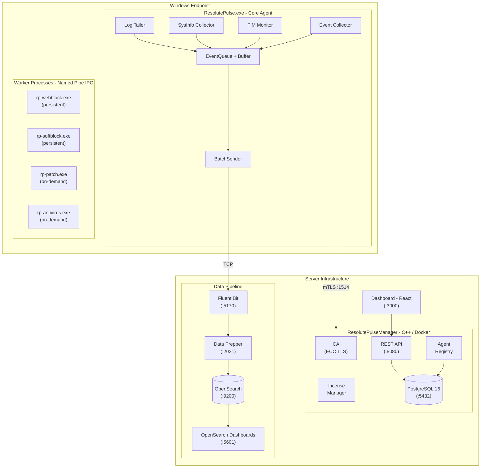

<p align="center">
  
</p>
<h1 align="center">Risknox Pulse</h1>
<p align="center">
  <strong>Enterprise Windows Endpoint Security Agent</strong><br>
  Real-time event collection · File integrity monitoring · Antivirus · Patch management · Centralized control
</p>
<p align="center">
  
  
  
  
  
  
</p>

---

## Table of Contents

- [Overview](#overview)
- [Architecture](#architecture)
- [Tech Stack](#tech-stack)
- [Project Structure](#project-structure)
- [Prerequisites](#prerequisites)
- [Building](#building)
- [Deployment](#deployment)
- [Configuration](#configuration)
- [Testing](#testing)
- [Remote Management (MODULE_COMMAND)](#remote-management-module_command)
- [CI/CD](#cicd)
- [Contributing](#contributing)

---

## Overview

**Risknox Pulse** (internal codename **ResolutePulse**) is a production-grade Windows endpoint security agent that provides comprehensive host-based threat detection and response capabilities:

| Capability | Description |
|---|---|
| **Event Collection** | Subscribes to 16+ Windows Event Log channels (Security, PowerShell, Sysmon, Defender, etc.) with per-channel Event ID filtering |
| **File Integrity Monitoring** | Monitors critical directories via NTFS USN Journal for real-time file change detection with SHA-256 hashing |
| **Antivirus** | Integrates bundled ClamAV for on-demand and scheduled malware scanning with auto-updating virus definitions |
| **Patch Management** | Scans for pending Windows Updates and supports remote-triggered installation |
| **Web Blocking** | Blocks access to specified URLs via Windows hosts file manipulation |
| **Software Blocking** | Terminates and prevents execution of specified applications |
| **System Information** | Collects OS info, installed applications, and open port inventory |
| **Log Forwarding** | Tails arbitrary log files and forwards them into the SIEM pipeline |
| **Centralized Management** | Registers with a Manager server over mTLS for policy dispatch, licensing, and remote control |

Collected telemetry flows through a **Fluent Bit → Data Prepper → OpenSearch** pipeline for SIEM-style analysis and visualization.

---

## Architecture



### Wire Protocol (RPLS)

Agent ↔ Manager communication uses a custom binary protocol:

| Field | Size | Description |
|---|---|---|
| Magic | 4 bytes | `RPLS` |
| Version | 1 byte | Protocol version |
| Type | 1 byte | Message type (see below) |
| Reserved | 2 bytes | — |
| Payload Length | 4 bytes | Big-endian |
| Payload | variable | JSON body |

**Message Types:** `REGISTER` (0x01–0x03), `HEARTBEAT` (0x10–0x11), `EVENT_BATCH` (0x20), `COMMAND` (0x30–0x31), `LICENSE` (0x40–0x41), `POLICY` (0x50–0x51), `STATUS_REPORT` (0x60–0x61), `MODULE_COMMAND` (0x70–0x71)

### Worker Process Model

The agent uses a **multi-process architecture** (inspired by Wazuh) with Named Pipe IPC:

- **Persistent workers** — Started at boot and auto-restarted on crash by a watchdog thread: `rp-webblock.exe`, `rp-softblock.exe`
- **On-demand workers** — Spawned per-job and exit when complete: `rp-patch.exe`, `rp-antivirus.exe`
- Communication via Windows Named Pipes (`\\.\pipe\rp-*`)

---

## Tech Stack

### Languages

| Language | Usage |
|---|---|
| **C++17** | Core agent, Manager server, all worker processes |
| **C# / .NET 10** | Desktop GUI (WPF — `RiskNoXMonitor.exe`) |
| **TypeScript / React 19** | Manager Dashboard (Vite + Tailwind CSS) |
| **JavaScript / React 18** | Pulse Frontend (CRA + Bootstrap) |
| **Node.js** | Pulse Backend (Express) |
| **Python** | Test scripts, legacy backend |
| **PowerShell** | Testing, ClamAV vendor updater |
| **Lua** | Fluent Bit XML event parsing |

### C++ Dependencies (vcpkg)

| Library | Purpose |
|---|---|
| [nlohmann-json](https://github.com/nlohmann/json) | JSON parsing |
| [cpp-httplib](https://github.com/yhirose/cpp-httplib) | HTTP client/server (REST API) |
| [spdlog](https://github.com/gabime/spdlog) | Structured logging |
| [SQLite3](https://sqlite.org) | Local event buffer + FIM database |
| [OpenSSL](https://openssl.org) | TLS/mTLS, certificates, hashing |

### Windows APIs

`wevtapi` · `advapi32` · `ws2_32` · `bcrypt` · `iphlpapi` · `netapi32` · `ole32` / `oleaut32`

### Infrastructure

| Component | Purpose | Default Port |
|---|---|---|
| **OpenSearch** | Log storage & search (SIEM) | 9200 |
| **OpenSearch Dashboards** | Visualization | 5601 |
| **Fluent Bit 3.2** | Log ingestion pipeline | 5170 |
| **Data Prepper** | Log transformation/enrichment | 2021 |
| **PostgreSQL 16** | Agent registry, certs, licenses, commands | 5432 |
| **Nginx** | Dashboard static file serving | 3000 (→ 80) |

---

## Project Structure

```
Agent/
├── src/                          # ─── C++ Source Code ───
│   ├── main.cpp                  # Entry point (Service / Console mode)
│   ├── Agent.cpp/.h              # Main agent orchestrator
│   ├── collector/                # Windows Event Log collection
│   ├── fim/                      # File Integrity Monitoring (USN Journal)
│   ├── sysinfo/                  # System info collectors (OS, apps, ports)
│   ├── antivirus/                # ClamAV antivirus worker
│   ├── patch/                    # Windows Update patch management
│   ├── webblock/                 # URL blocking (hosts file)
│   ├── appblock/                 # Application blocking
│   ├── policy/                   # Policy dispatch from Manager
│   ├── workers/                  # Worker process management + watchdog
│   ├── ipc/                      # Named Pipe IPC channel
│   ├── agent/                    # mTLS registration & TLS sender
│   │   ├── registration/         #   CertificateStore, RegistrationClient
│   │   └── network/              #   TlsSender
│   ├── queue/                    # Thread-safe event queue
│   ├── buffer/                   # SQLite-backed persistent event buffer
│   ├── sender/                   # Batch event sender
│   ├── network/                  # TCP sender to Fluent Bit
│   ├── config/                   # Configuration management
│   ├── service/                  # Windows Service integration
│   ├── logtailer/                # Log file tailing (header-only)
│   ├── common/                   # Protocol.h (RPLS wire protocol)
│   ├── utils/                    # Logger, Base64, PathUtils
│   ├── manager/                  # ─── Manager Server ───
│   │   ├── main.cpp              # Manager entry point
│   │   ├── ca/                   # Certificate Authority (ECC)
│   │   ├── db/                   # PostgreSQL client
│   │   ├── server/               # mTLS server + agent handler
│   │   ├── registry/             # Agent registry + license manager
│   │   └── api/                  # REST API (:8080)
│   └── gui/                      # ─── Desktop Monitor GUI ───
│       └── RiskNoXMonitor/       # .NET 10 WPF application
│
├── manager/
│   ├── Dockerfile                # Manager Docker build (Ubuntu)
│   ├── CMakeLists.txt            # Linux CMake for Manager
│   └── dashboard/                # React 19 + Vite + Tailwind dashboard
│       ├── src/
│       └── Dockerfile            # Dashboard Docker build (Nginx)
│
├── Pulse/                        # ─── Pulse Platform (Legacy) ───
│   ├── backend/                  # Node.js / Express API
│   └── frontend/                 # React 18 / Bootstrap SPA
│
├── tests/                        # C++ unit/integration tests + scripts
├── db/migrations/                # PostgreSQL schema (schema.sql)
├── scripts/                      # EC2 bootstrap, cert gen, ClamAV updater
├── deploy/                       # Deployment scripts
├── vendor/clamav/                # Bundled ClamAV runtime
├── thirdparty/                   # Header-only C++ libs (spdlog, sqlite3, etc.)
├── libs/                         # Additional libraries
├── data-prepper/                 # Data Prepper pipeline configs
├── fluent-bit.conf               # Fluent Bit configuration
├── fluent-bit-scripts/           # Lua scripts for log parsing
├── installer_assets/             # Installer branding & configs
├── ca/                           # Generated CA certificates
│
├── CMakeLists.txt                # Root CMake build (agent + workers + tests)
├── vcpkg.json                    # C++ package manifest
├── config.json                   # Agent configuration
├── docker-compose.yml            # Local dev stack
├── docker-compose.ec2.yml        # EC2 production stack
├── installer.iss                 # Inno Setup installer script
├── .github/workflows/            # CI/CD pipelines
└── .gitignore
```

---

## Prerequisites

### Agent Build (Windows)

- **MinGW-w64** (GCC 12+) or MSVC with C++17 support
- **CMake** ≥ 3.20
- **vcpkg** — [Install guide](https://vcpkg.io/en/getting-started.html)
- **OpenSSL** (via vcpkg)
- **PostgreSQL 18** (optional — only needed for building the Manager on Windows)

### Server Infrastructure (Docker)

- **Docker** ≥ 20.10
- **Docker Compose** ≥ 2.0

### Desktop GUI

- **.NET 10 SDK** (with Windows Desktop workload)

### Dashboard

- **Node.js** ≥ 20

---

## Building

### Agent (Windows — MinGW)

```powershell
# 1. Configure
cmake -B build -G "MinGW Makefiles" `
  -DCMAKE_TOOLCHAIN_FILE="<vcpkg-root>/scripts/buildsystems/vcpkg.cmake" `
  -DCMAKE_BUILD_TYPE=Release

# 2. Build all targets
cmake --build build -j

# Output executables:
#   build/ResolutePulse.exe          (core agent)
#   build/rp-webblock.exe            (web blocking worker)
#   build/rp-softblock.exe           (software blocking worker)
#   build/rp-patch.exe               (patch management worker)
#   build/rp-antivirus.exe           (antivirus worker)
#   build/ResolutePulseManager.exe   (manager — if PostgreSQL found)
```

### Manager + Dashboard (Docker)

```bash
# Build and start the full server stack
docker compose up -d --build

# Services started:
#   opensearch         :9200    — Log storage
#   opensearch-dashboards :5601 — Visualization
#   fluent-bit         :5170    — Log ingestion
#   data-prepper       :2021    — Log transformation
#   postgres           :5432    — Agent registry DB
#   manager            :1514    — Agent mTLS endpoint
#                      :8080    — REST API
#   dashboard          :3000    — Web dashboard
```

### Desktop GUI (WPF)

```powershell
cd src/gui/RiskNoXMonitor
dotnet publish -c Release -r win-x64 --self-contained
```

### Windows Installer

Build the Inno Setup installer using `installer.iss`:

```powershell
# Requires Inno Setup 6+ installed
iscc installer.iss
# Output: installer_output/RisknoxPulseSetup.exe
```

The installer bundles:
- Core agent + all worker executables
- RiskNoX Monitor GUI (optional component)
- ClamAV runtime (optional component)
- Registers the `ResolutePulse` Windows Service
- Schedules daily ClamAV definition updates (3 AM)

---

## Deployment

### Local Development

```bash
# Start the backend infrastructure
docker compose up -d

# Run the agent in console mode (no service registration)
.\build\ResolutePulse.exe --console
```

### EC2 Production

```bash
# One-time EC2 setup
bash scripts/ec2-bootstrap.sh

# Start services (uses pre-built Docker Hub images)
docker compose -f docker-compose.ec2.yml up -d
```

The EC2 stack includes **Watchtower** which polls Docker Hub every 5 minutes for new images and auto-restarts containers — push-to-deploy is automatic via CI/CD.

---

## Configuration

### Agent — `config.json`

The agent is configured via `config.json` (installed to `%ProgramData%\Risknox Pulse\` by the installer):

| Section | Key Settings |
|---|---|
| `fluent_bit_host/port` | Telemetry destination (default `localhost:5170`) |
| `manager` | Manager server connection — host, port, certs dir, heartbeat interval |
| `fim` | Monitored directories, exclude patterns, max file size, baseline interval |
| `event_channels` | Windows Event Log channels to subscribe to |
| `event_filters` | Per-channel Event ID allow-lists for noise reduction |
| `buffer` | Event buffer settings — max events (50,000), flush interval, SQLite DB path |
| `system_info` | Collection schedule and what to collect (apps, ports, OS info) |
| `patch_management` | Auto-scan/install toggles, scan interval, excluded KBs |
| `antivirus` | Auto-scan, definition update schedule, scan paths |
| `web_blocking` | Feature toggle |
| `software_blocking` | Feature toggle, monitoring interval |
| `log_forwarding` | Custom log file tailing definitions |
| `log_level` | Logging verbosity (`debug`, `info`, `warn`, `error`) |

### Manager — Environment Variables

| Variable | Description | Default |
|---|---|---|
| `RPLS_DB_CONN` | PostgreSQL connection string | — |
| `RPLS_PORT` | mTLS listen port | `1514` |
| `RPLS_API_PORT` | REST API port | `8080` |
| `DB_PASSWORD` | Database password | — |

### Data Pipeline

| File | Purpose |
|---|---|
| `fluent-bit.conf` | TCP input → field renaming → HTTP output to Data Prepper |
| `data-prepper/pipelines.yaml` | Event routing, XML/JSON parsing, ECS field mapping, OpenSearch sink |
| `fluent-bit-scripts/parse_windows_xml.lua` | Lua script for parsing Windows XML event logs |

---

## Testing

### C++ Unit & Integration Tests

```powershell
# Build test targets
cmake --build build -j

# Run individual tests
.\build\test_ca.exe                 # Certificate Authority
.\build\test_postgres_client.exe    # PostgreSQL client (mocked libpq)
.\build\test_manager_server.exe     # Manager server integration
.\build\test_agent_registry.exe     # Agent registry
.\build\test_license_manager.exe    # License manager
.\build\test_agent_handler.exe      # Agent handler integration
.\build\test_agent_tls.exe          # Agent TLS (CertStore, Registration, TlsSender)
.\build\verify_licenses.exe         # License verification (requires live DB)
```

### Script-Based Tests

```powershell
# Policy testing
.\tests\test_all_policies.ps1

# Module command testing
.\tests\test_module_commands.ps1

# Antivirus testing
python .\tests\test_av_scan.py
.\test_av_commands.ps1
.\test_av_oneliners.ps1

# TCP command testing
python .\tests\test_tcp_cmd.py
```

See [AV_TEST_GUIDE.md](AV_TEST_GUIDE.md) for detailed antivirus testing instructions including payload flow diagrams and troubleshooting.

---

## Remote Management (MODULE_COMMAND)

The Manager can remotely control connected agents via the following command verbs:

| Verb | Description |
|---|---|
| `collector_start` / `collector_stop` | Resume / pause event collection |
| `fim_start` / `fim_stop` | Resume / pause FIM monitoring |
| `worker_restart` | Restart all persistent worker subprocesses |
| `status_request` | Force an immediate status report |
| `diagnostics` | Return live counters (events collected/sent/filtered, worker status) |
| `config_get` | Return active config (full or a specific section) |
| `config_push` | Push new config section, persist to disk, and apply live |
| `agent_restart` | Schedule a graceful agent restart |
| `av_update` | Trigger ClamAV virus definition update |
| `av_version` | Query ClamAV database metadata |

Commands are dispatched through the REST API (`POST /api/agents/:id/commands`) and delivered to the agent over the mTLS channel.

---

## Database

### PostgreSQL Schema

The full database schema is defined in a single file — [`schema.sql`](db/migrations/schema.sql) — which is automatically loaded by PostgreSQL on first container start via Docker's `initdb` mechanism.

| Table | Purpose |
|---|---|
| `agents` | Registered agent info (agent_id, hostname, os_type, status, cert_serial) |
| `certificates` | All issued certificates with revocation tracking |
| `licenses` | License keys (TRIAL / STANDARD / ENTERPRISE) with validity dates |
| `policy_commands` | Policy commands for agents (web blocking, software blocking, patch, AV) |
| `module_commands` | Module control commands (diagnostics, config push, AV update, etc.) |
| `agent_status_reports` | Stored status reports from agents |

**Views:** `module_command_log`, `stale_pending_commands`

### SQLite (Agent-Side)

| Database | Purpose |
|---|---|
| `events_buffer.db` | Persistent event buffer for reliability during network outages |
| `fim_baseline.db` | FIM file baseline data (path, hash, size, timestamps) |

---

## CI/CD

Two GitHub Actions workflows automate deployment:

| Workflow | Trigger | Pipeline |
|---|---|---|
| `deploy-manager.yml` | Push to `main` (changes in `src/manager/**`, `manager/Dockerfile`) | Build Docker image → Push to Docker Hub → SSH deploy to EC2 |
| `deploy-dashboard.yml` | Push to `main` (changes in `manager/dashboard/**`) | Build Docker image → Push to Docker Hub → SSH deploy to EC2 |

Both workflows:
- Use Docker Buildx with registry layer caching
- Push two tags: `latest` + `{git-sha}` for rollback
- Deploy via SSH to EC2 instance
- Auto-deploy completes via Watchtower on the EC2 host

---

## Contributing

1. Create a feature branch from `main`
2. Make your changes and ensure tests pass
3. Submit a pull request with a clear description

### Code Style

- **C++**: C++17, `snake_case` for functions/variables, `PascalCase` for classes
- **TypeScript/React**: Standard ESLint + Prettier configuration
- **Commits**: Use descriptive commit messages

---

<p align="center">
  <sub>© 2026 Risknox — All Rights Reserved</sub>
</p>
